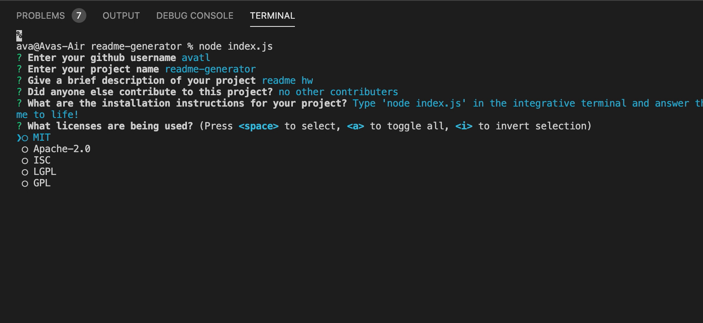
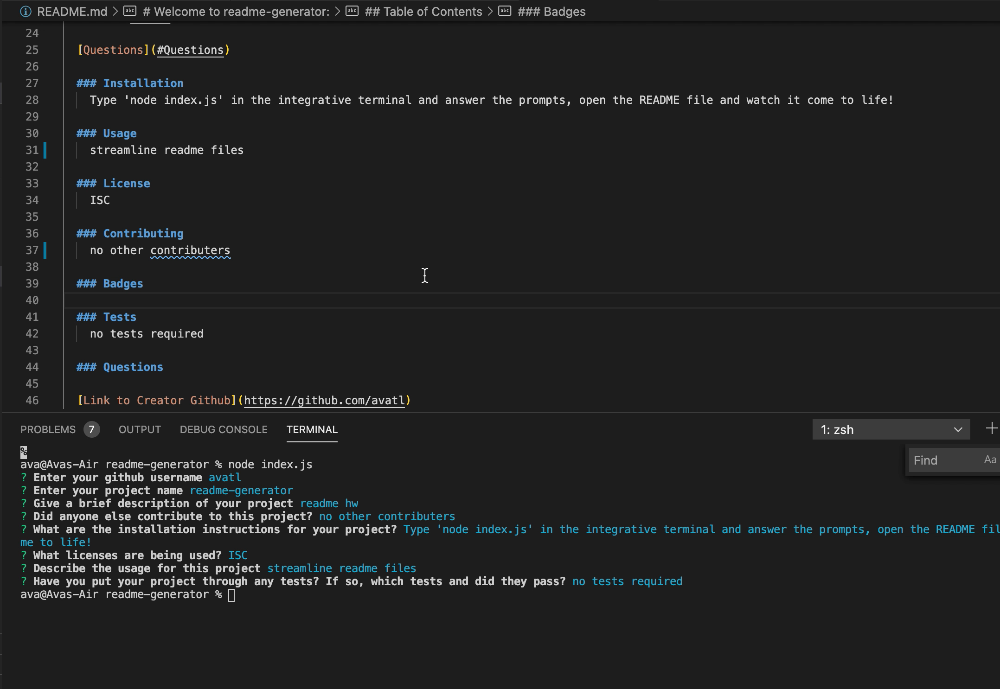

  
  ### readme-generator
  
  # Welcome to readme-generator:

  ## Description
  For this assignment, I created a file in JavaScript that allows you to answer questions with Node in the integrated terminal. The responses that you give Node will be written into the README file associated with the project you open this function in, so it will look and work like a well written README. 

  [Video Demo Download](Assets/hw3.mov)

  
  